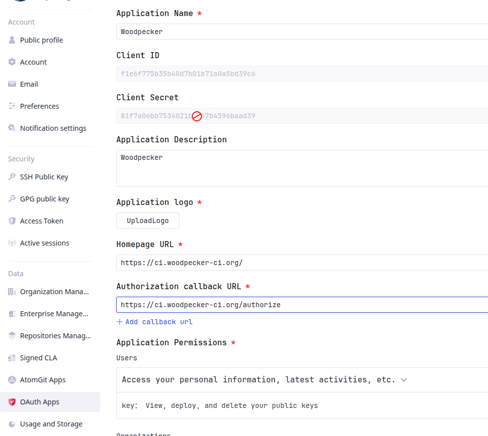

# AtomGit

Woodpecker comes with built-in support for [AtomGit](https://atomgit.com).
To use Woodpecker with AtomGit the following environment variables should be set for the server component:

```ini
WOODPECKER_ATOMGIT=true
WOODPECKER_ATOMGIT_CLIENT=YOUR_ATOMGIT_CLIENT_ID
WOODPECKER_ATOMGIT_SECRET=YOUR_ATOMGIT_CLIENT_SECRET
```

You will get these values from AtomGit when you register your OAuth application.
To do so, go to your personal settings -> OAuth2 Applications -> Create a new OAuth2 App.

## Registration

Register your application with AtomGit to create your client id and secret.
The authorization callback URL must match your Woodpecker instance's scheme and hostname exactly, with `https://<host>/authorize` as the path.

### Application Settings

- Name: An arbitrary name for your App
- Homepage URL: The URL of your Woodpecker instance
- Callback URL: `https://<your-woodpecker-instance>/authorize`



## Configuration

This is a full list of configuration options. Please note that many of these options use default configuration values that should work for the majority of installations.

---

### ATOMGIT

- Name: `WOODPECKER_ATOMGIT`
- Default: `false`

Enables the AtomGit driver.

---

### ATOMGIT_URL

- Name: `WOODPECKER_ATOMGIT_URL`
- Default: `https://api.atomgit.com`

Configures the AtomGit API server address.

---

### ATOMGIT_CLIENT

- Name: `WOODPECKER_ATOMGIT_CLIENT`
- Default: none

Configures the AtomGit OAuth client id. This is used to authorize access.

---

### ATOMGIT_CLIENT_FILE

- Name: `WOODPECKER_ATOMGIT_CLIENT_FILE`
- Default: none

Read the value for `WOODPECKER_ATOMGIT_CLIENT` from the specified filepath.

---

### ATOMGIT_SECRET

- Name: `WOODPECKER_ATOMGIT_SECRET`
- Default: none

Configures the AtomGit OAuth client secret. This is used to authorize access.

---

### ATOMGIT_SECRET_FILE

- Name: `WOODPECKER_ATOMGIT_SECRET_FILE`
- Default: none

Read the value for `WOODPECKER_ATOMGIT_SECRET` from the specified filepath.

---

### FORGE_SKIP_VERIFY

- Name: `WOODPECKER_FORGE_SKIP_VERIFY`
- Default: `false`

Configure if SSL verification should be skipped.

---

### FORGE_OAUTH_HOST

- Name: `WOODPECKER_FORGE_OAUTH_HOST`
- Default: `https://atomgit.com`

Configures the OAuth authorization endpoint. The AtomGit API host (`api.atomgit.com`) returns correct clone URLs, but its OAuth endpoints live on the web host (`atomgit.com`). This option allows overriding the OAuth host if needed.
