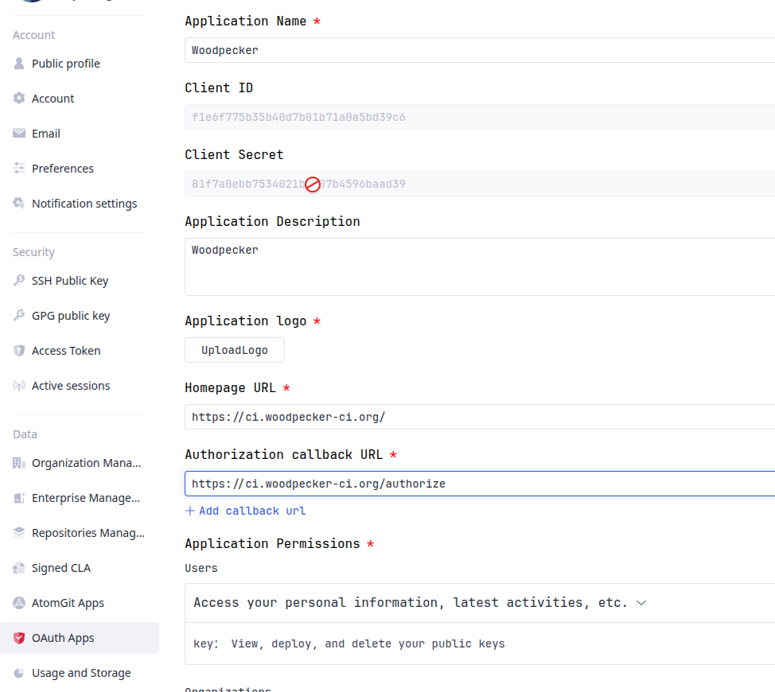

# GitCode

Woodpecker comes with built-in support for [GitCode](https://gitcode.com).
To use Woodpecker with GitCode the following environment variables should be set for the server component:

```ini
WOODPECKER_GITCODE=true
WOODPECKER_GITCODE_CLIENT=YOUR_GITCODE_CLIENT_ID
WOODPECKER_GITCODE_SECRET=YOUR_GITCODE_CLIENT_SECRET
```

You will get these values from GitCode when you register your OAuth application.
To do so, go to your personal settings -> OAuth2 Applications -> Create a new OAuth2 App.

## Registration

Register your application with GitCode to create your client id and secret.
The authorization callback URL must match your Woodpecker instance's scheme and hostname exactly, with `https://<host>/authorize` as the path.

### Application Settings

- Name: An arbitrary name for your App
- Homepage URL: The URL of your Woodpecker instance
- Callback URL: `https://<your-woodpecker-instance>/authorize`



## Configuration

This is a full list of configuration options. Please note that many of these options use default configuration values that should work for the majority of installations.

---

### GITCODE

- Name: `WOODPECKER_GITCODE`
- Default: `false`

Enables the GitCode driver.

---

### GITCODE_URL

- Name: `WOODPECKER_GITCODE_URL`
- Default: `https://api.gitcode.com`

Configures the GitCode API server address.

---

### GITCODE_CLIENT

- Name: `WOODPECKER_GITCODE_CLIENT`
- Default: none

Configures the GitCode OAuth client id. This is used to authorize access.

---

### GITCODE_CLIENT_FILE

- Name: `WOODPECKER_GITCODE_CLIENT_FILE`
- Default: none

Read the value for `WOODPECKER_GITCODE_CLIENT` from the specified filepath.

---

### GITCODE_SECRET

- Name: `WOODPECKER_GITCODE_SECRET`
- Default: none

Configures the GitCode OAuth client secret. This is used to authorize access.

---

### GITCODE_SECRET_FILE

- Name: `WOODPECKER_GITCODE_SECRET_FILE`
- Default: none

Read the value for `WOODPECKER_GITCODE_SECRET` from the specified filepath.

---

### FORGE_SKIP_VERIFY

- Name: `WOODPECKER_FORGE_SKIP_VERIFY`
- Default: `false`

Configure if SSL verification should be skipped.

---

### FORGE_OAUTH_HOST

- Name: `WOODPECKER_FORGE_OAUTH_HOST`
- Default: `https://gitcode.com`

Configures the OAuth authorization endpoint. The GitCode API host (`api.gitcode.com`) returns correct clone URLs, but its OAuth endpoints live on the web host (`gitcode.com`). This option allows overriding the OAuth host if needed.
